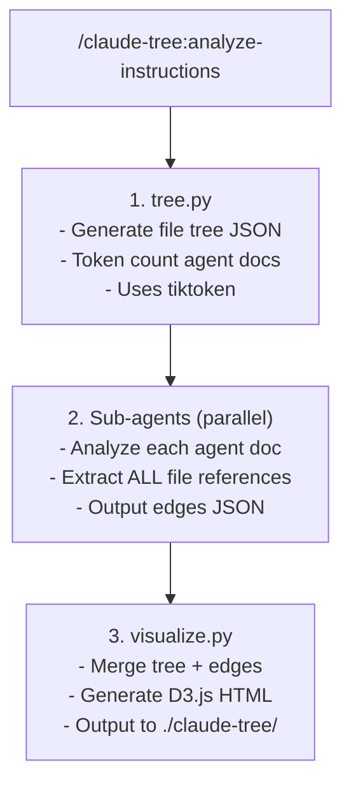

# claude-tree

Visualize CLAUDE.md/AGENTS.md instruction files as an interactive tree with token-weighted nodes and reference edges.

## Installation

Run these commands inside of Claude Code.

NOTE: once you enable the plugin you may need to exit Claude Code and start a new session or resume the previous one.

```bash
# Adding the plugin marketplace to Claude Code
/plugin marketplace add larsenweigle/claude-tree

# You will need to enable it with the /plugin command once installed

# Then invoke the skill
/claude-tree:analyze-instructions
# or
/analyze-instructions
```

## Requirements

- [uv](https://docs.astral.sh/uv/) - Python package runner
  - macOS: `brew install uv`
  - Other: `curl -LsSf https://astral.sh/uv/install.sh | sh`

## How It Works



## Visualization Features

- **Collapsible tree view** of your codebase
- **Token-weighted nodes**: Agent docs colored by size (configurable thresholds)
  - Green: < 1,000 tokens (optimal)
  - Yellow: 1,000-2,000 tokens (acceptable)
  - Red: ≥ 2,000 tokens (consider splitting)
- **Configurable thresholds**: Adjust green/yellow/red boundaries in the Legend sidebar to match your team's preferences
- **Reference edges**: Curved lines showing file references
  - Solid: agent-doc → agent-doc
  - Dashed: agent-doc → regular file
- **View modes**:
  - **Reference View**: Shows reference edges between files
  - **Path View**: Tree links colored by cumulative tokens using the same threshold system
- **Agent walk simulator**: Click any directory to see cumulative tokens Claude loads when working there
- **Heaviest Paths**: Top directories ranked by cumulative token cost
- **Copy reports**: Each sidebar section has a copy button for markdown export
  - **Agent Docs by Tokens**: Table of all agent docs with token counts and status
  - **Heaviest Paths**: Top 10 directories by cumulative token cost
  - **Agent Walk Simulator**: Context chain for selected directory

## Output

All artifacts saved to `./claude-tree/` in your repo:

```
./claude-tree/
├── tree.json              # File tree with token counts
├── edges/                 # Individual edge files from sub-agents
├── edges.json             # Merged edges
└── visualization/
    └── index.html         # Interactive visualization
```

Add `claude-tree/` to `.gitignore` if you don't want to commit artifacts.

## Token Budget Guidelines

Default thresholds (adjustable in the visualization UI):

| File Type | Recommended Max |
|-----------|-----------------|
| Root CLAUDE.md | 2,000 tokens |
| Subtree AGENTS.md | 2,000 tokens |
| Total chain at any path | 5,000 tokens |

These are sensible defaults, but different sizes may be appropriate for different teams and codebases. Adjust the limits to your own preferences using the threshold inputs in the Legend sidebar.
